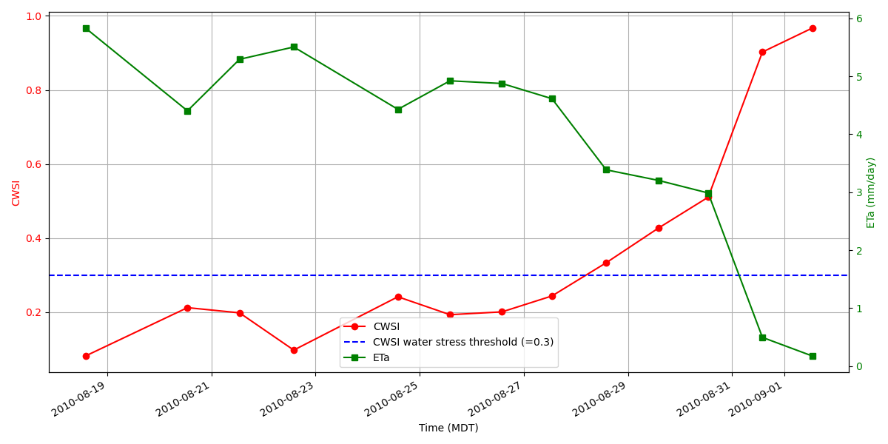
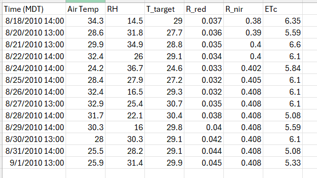

# Crop Water Stress Index (CWSI) and Actual Evapotranspiration (ETa) Calculation
This repository contains code and resources related to Crop Water Stress Index (CWSI) and actual evapotranspiration (ETa) modeling for the course `CIVE 519: Irrigation Water Management` using Infra-red thermometer (IRT) sensor data. The weather and ETc values used here as datasets have been provided. However, real inputs, including Penman-Monteith's ETref calculation, and soil moisture balance can be integrated here (look into `SWB_Irr repo` in author's GitHub) to upgrade it into a more advance model.

## Features
`NDVI and Fractional Vegetation Cover Calculation:` Estimates NDVI from NIR and Red bands and calculates scaled NDVI for fractional vegetation cover.  
`Target Emissivity and Temperature Correction:` Calculates surface emissivity for mixed vegetation and soil pixels and adjusts brightness temperature considering background temperature.   
`CWSI Calculation:` Calculates CWSI using temperature, emissivity, and vapor pressure deficit to indicate plant water stress levels.   
`ETa Estimation:` Estimates actual evapotranspiration based on CWSI and potential ET.    

## To install and run the scripts
To use the code in this repository, clone it to your local machine using Git:

git clone https://github.com/mdfahimhasan/CWSI_ETa.git

To run the scripts - use the `ETa_IRT_run.ipynb` file to run the model.

## Input data requirement and units 
The following variables are required as daily inputs for the model, and must be formatted as described below:  

`air temperature`: deg C  
`T_target (IRT sensor-detected calibrated temperature)`: deg C  
`RH`: %  
`NIR and Red bands`: unitless  
`ETc`: mm/d  

A sample input data file (.csv format) will look like this-

